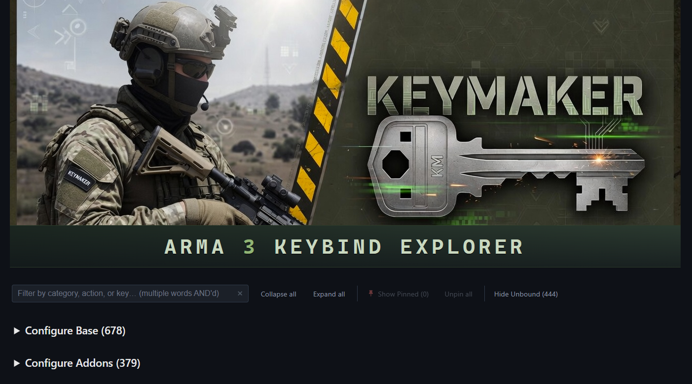
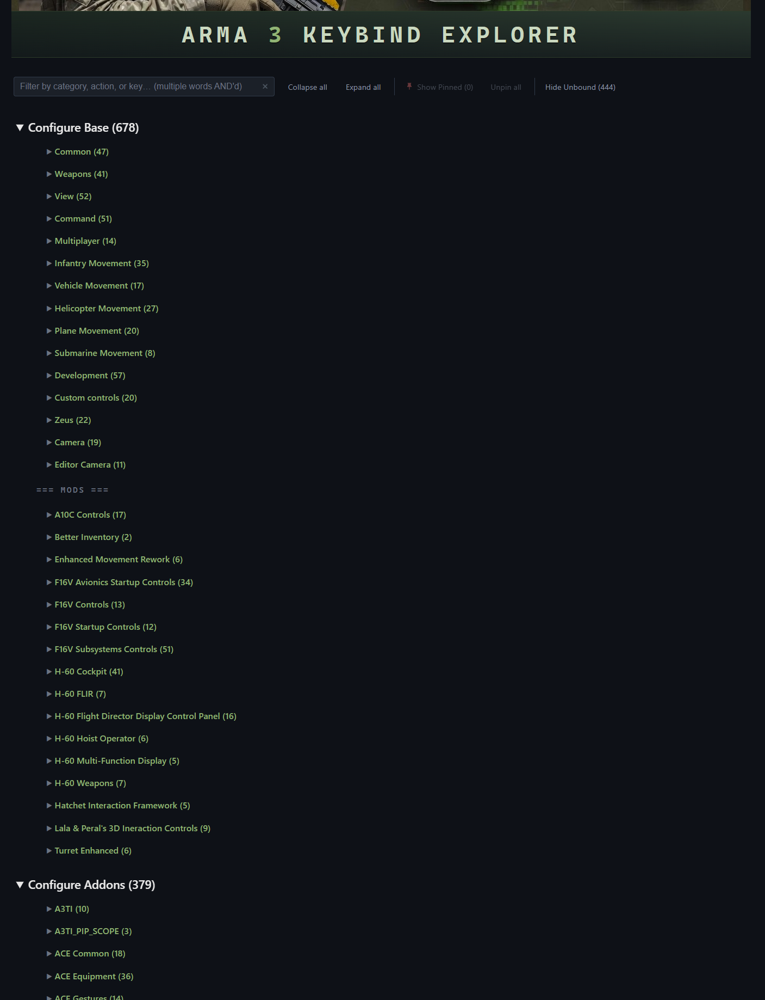
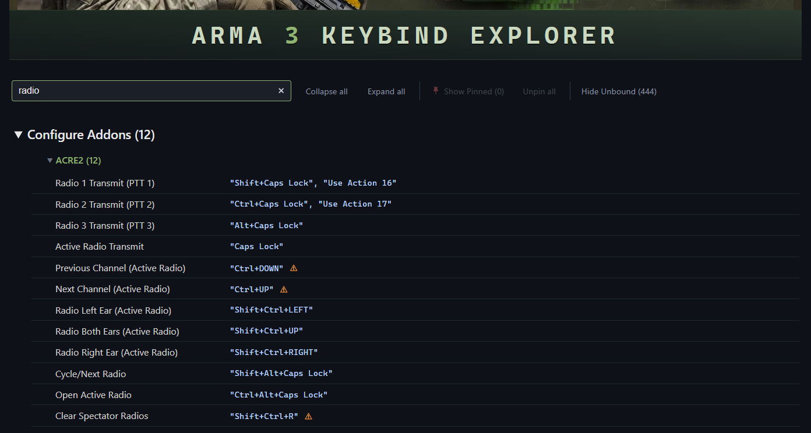
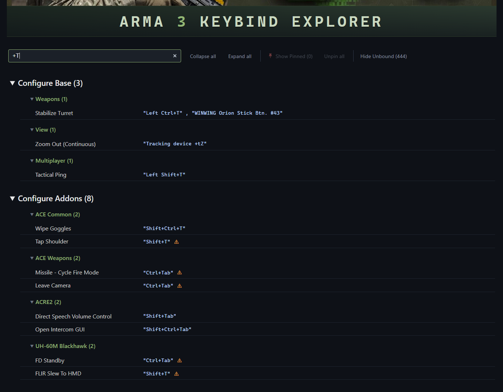
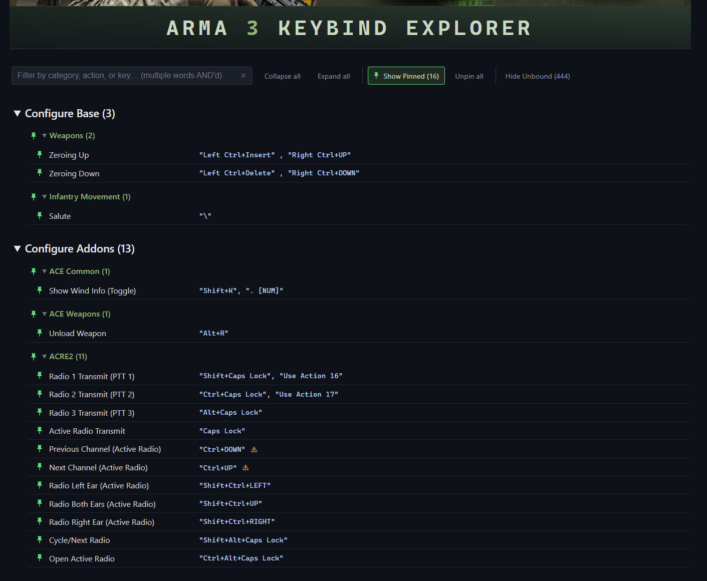
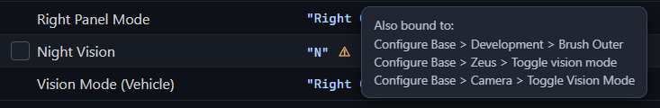
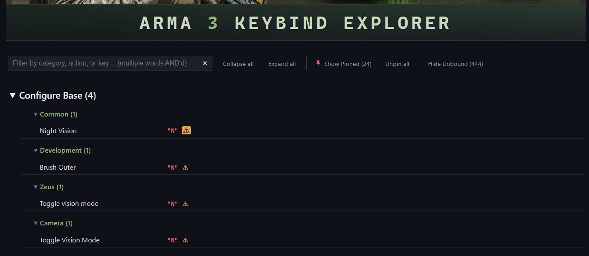

# Keymaker - ARMA 3 Keybind Explorer (a3_keymaker)

**See every Arma 3 keybinding in one searchable HTML page.** Vanilla, old-style mods, and CBA addons — all together, grouped exactly the way the in-game dialog shows them.

- 🔍 **Filter** by category, action name, or keybind
- 📌 **Build a cheatsheet** by pinning the rows you care about
- ⚠ **Find and resolve keybind collisions**

---

## 📸 What you'll get

A single self-contained HTML file. The page has two top-level collapsable sections — `Configure Base` and `Configure Addons` — each with sub-categories (Common, Weapons, View, Command…) preserving the in-game order.



**🔍 Filter** by category, action name, or keybind.





**📌 Build your cheatsheet** by pinning the rows you actually use.



**⚠ Find and resolve keybind collisions** (hover or click the ⚠ marker)





---

## 🚀 Quick start

Requires Python 3.10+ and Arma 3.

> 💡 **No Python?** Grab the standalone Windows binary from the [latest release](https://github.com/0xWhoa/a3_keymaker/releases/latest) — drop it anywhere and run `a3_keymaker.exe` instead of `a3_keymaker` in the steps below. Each release lists a SHA-256 hash and VirusTotal scan link for verification.
>
> *Unsigned binary — Windows may warn on first run. Click **More info → Run anyway**.*

1. **Open a terminal** in the project directory
2. **Setup once** *(Python users)*: `pip install -e .` — skip if using the `.exe`
3. **Execute Keymaker:** run `a3_keymaker` — copies the Arma 3 script to your clipboard
4. **In Arma 3:** pause the game, paste the script into Debug Console, click **LOCAL EXEC**. The script waits for the `Controls` dialog to open.
5. **Open the `Controls` dialog:** The script walks through the categories extracting keybindings. Then click `Configure Addons` and let the script walk through the addons.

> 💡 When the script finishes, the keybinding dump will be on your clipboard.

6. **Save the dump** to a text file (e.g. `dump.txt`)
7. **Execute Keymaker** with the dump file: `a3_keymaker dump.txt` — writes the final HTML file.

Full step-by-step below. ⬇

---

## 💻 Setup (Python users, ~30 seconds)

```sh
cd a3_keymaker
pip install -e .
```

Installs the `a3_keymaker` CLI on your PATH. **You only do this once.**

---

## 🎮 Generate your keymap (~2 minutes)

### 1. **Launch** Arma 3 with your usual modset.

### 2. **Open** Singleplayer mode.

Play → Play Singleplayer (or just press **Enter**). You'll spawn into the game.

### 3. **Open** the Debug Console.

Press **Esc** → you should see the **Debug Console** in the pause menu.

### 4. **Copy** the extractor SQF script to your clipboard.

In a terminal (no arguments):

```sh
a3_keymaker
```

You'll see *"Keybind extraction script copied to clipboard. Paste it into Arma 3's Debug Console (LOCAL EXEC)."*

### 5. **Paste** the script into the Debug Console's Execute box and click **LOCAL EXEC**.

> ⚠ **Important:** the script runs silently in the background. **You won't see any output yet.** This is expected — it's waiting for you to open the Controls dialog.

### 6. **Open** OPTIONS → CONTROLS.

The SHOW dropdown will visibly start cycling through every category. *Don't touch anything.*

### 7. **Click** CONFIGURE ADDONS when the cycling stops.

The ADDON dropdown will cycle through every mod.

### 8. **Click** CANCEL when cycling stops again.

### 9. **Paste** your clipboard into a text file.

For example, `C:\tmp\dump.txt`.

### 10. **Render** the HTML.

```sh
a3_keymaker C:\tmp\dump.txt
```

Writes `YYYY_MM_DD-Arma3_Keymaker.html` (today's date) in the current directory. Open it in any browser. ✅

> 💡 *Clipboard not cooperating?* Open [`extract_all.sqf`](src/a3_keymaker/scripts/extract_all.sqf) in any text editor, select all, and copy directly.

### Optional flags

```sh
a3_keymaker C:\tmp\dump.txt -o C:\path\to\keymap.html --json C:\path\to\keymap.json
```

| Flag | Default | Purpose |
|---|---|---|
| `-o`, `--output` | `YYYY_MM_DD-Arma3_Keymaker.html` | Output HTML path |
| `--json` | (none) | Also emit a parallel JSON dump (handy for tooling, diffs, automation) |

---

## 📖 Using the keymap

### 🔍 Filter

- Substring match against category, action label, action ID, *and* key text in one shot.
- **Multiple words are AND'd:** `ctrl m` matches rows with both "ctrl" and "m" anywhere.
- Sections and categories with matching rows **auto-expand** while filtering. Manual open/closed state is preserved when the filter clears.
- **Esc** clears any active filter. Press again to collapse everything. Spam Esc to fully reset.

### 📌 Pin / Show Pinned / Hide Unbound

- **Pin** any row or category — pin checkboxes appear on hover. Pins persist across refreshes (stored in your browser).
- **Show Pinned (N)** toggle — show only your pinned rows.
- **Hide Unbound (N)** toggle — hide rows with no key assigned.
- **Unpin all** wipes everything in one click.
- Pinning a category pins every *visible* row in it — combine with the filter to bulk-pin a subset.

### ⚠ Investigate conflicts

- A **⚠ marker** appears next to any key bound by more than one action.
- **Hover** for the list of all parties involved.
- **Click any ⚠** to isolate the page to that conflict group — the clicked marker becomes an amber chip. Click again (or press Esc) to exit.
- Inside collision view, only the keys *actually shared* with the clicked row are highlighted red — so context-disambiguated overlaps (W = walk forward / accelerate vehicle) don't visually scream at you.

### 🧭 Navigate the page

- **Sticky stack** — the controls bar, section summary, `=== Mods ===` separator, and current category summary all stick to the top while you scroll. You always know where you are.
- **Collapse all / Expand all** buttons in the action bar.
- **Hover any action label** → tooltip shows the full path (`Configure Base > Category > Action`) so you can navigate straight to it in-game.
- **Open/closed layout survives refreshes** (also saved in your browser).

---

## 📊 What's covered

The extractor combines five data sources to maximize coverage:

| Source | Covers |
|---|---|
| UI walk of `CONTROLS` dialog | Every label in every category, in dropdown order |
| `actionKeysNames` over the [BIS wiki](https://community.bistudio.com/wiki/inputAction/actions)'s 446 engine action IDs | Every vanilla action's current binding |
| `CfgDefaultKeysPresets >> * >> Mappings` (all 8 sibling presets, deduped) | Old-style mod IDs that have a default key |
| `CfgUserActions` walk | Old-style mod IDs *without* default keys |
| UI walk of `CONFIGURE ADDONS` | Every CBA-registered mod's bindings, label + key inline |

For a typical heavily-modded install: **~1000 actions across ~50 categories**.

---

## For developers

### Project layout

```
a3_keymaker/
├── pyproject.toml
├── README.md                       # this file
├── ARCHITECTURE.md                 # design rationale, component-level details
├── src/
│   └── a3_keymaker/
│       ├── __init__.py
│       ├── cli.py                  # CLI entry point
│       ├── model.py                # Action, Report dataclasses
│       ├── parser.py               # SQF dump → ParsedDump (handles "" escaping + clipboard mojibake)
│       ├── merger.py               # ParsedDump + wiki JSON → list[Action]
│       ├── render.py               # list[Action] → self-contained HTML
│       ├── data/                   # vanilla_actions.json (446 wiki entries) + keymaker_banner.png
│       └── scripts/                # extract_all.sqf (in-game extractor)
└── tests/
    ├── test_pipeline.py            # 18 tests, runs against a captured dump fixture
    └── fixtures/sample_dump.txt    # real dump used by the test suite
```

### Development & Testing

```sh
pip install -e .[dev]
pytest -v
```

The fixture `tests/fixtures/sample_dump.txt` is a real captured dump from a heavily-modded install, so the tests exercise every code path against realistic data.

See [ARCHITECTURE.md](ARCHITECTURE.md) for design rationale and component-level details (parser, merger, renderer internals; SQF extractor phases; sticky-stack rendering).
